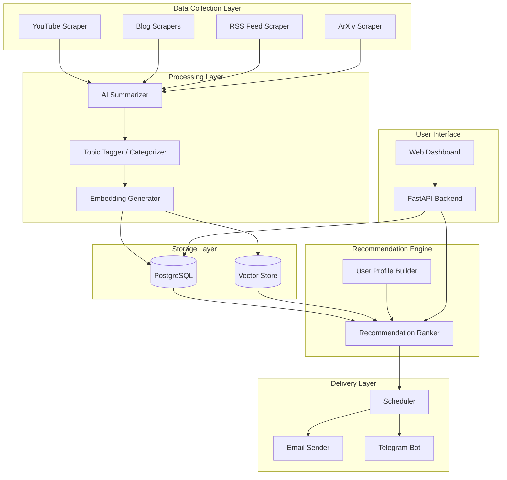
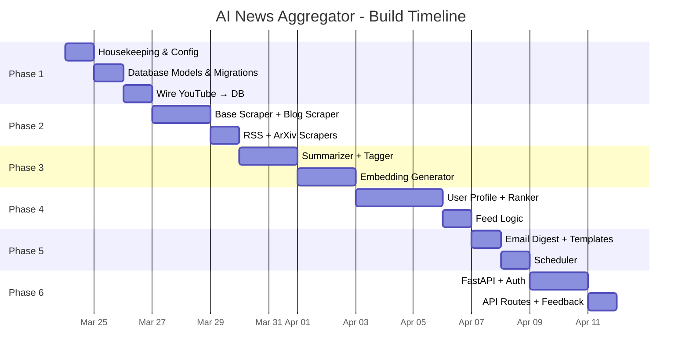

# AI News Aggregator — Implementation Plan

## 🎯 Product Vision

A personalized AI news aggregator that:
1. **Collects** news from YouTube channels, AI blogs, RSS feeds, and more
2. **Understands** what each user likes using ML (embeddings + interaction tracking)
3. **Recommends** relevant articles/videos ranked by user preference
4. **Delivers** a daily digest via email or messaging (Telegram/WhatsApp)

---

## 📊 Current Progress

| Component | Status | File |
|-----------|--------|------|
| YouTube RSS scraper | ✅ Done | [app/scrapers/youtube.py](file:///Users/hemant/Desktop/news/ai/ai-news-agg/app/scrapers/youtube.py) |
| Transcript fetcher | ✅ Done | [app/scrapers/youtube.py](file:///Users/hemant/Desktop/news/ai/ai-news-agg/app/scrapers/youtube.py) (+ [app/sevices/transcript.py](file:///Users/hemant/Desktop/news/ai/ai-news-agg/app/sevices/transcript.py)) |
| Pydantic models | ✅ Started | [ChannelVideo](file:///Users/hemant/Desktop/news/ai/ai-news-agg/app/scrapers/youtube.py#15-22), [Transcript](file:///Users/hemant/Desktop/news/ai/ai-news-agg/app/scrapers/youtube.py#11-13) |
| Database | ❌ Not started | — |
| Web scrapers | ❌ Not started | — |
| ML/Recommendation | ❌ Not started | — |
| User system | ❌ Not started | — |
| Notification delivery | ❌ Not started | — |
| API / Frontend | ❌ Not started | — |
| Scheduler | ❌ Not started | — |

---

## 🏗️ Architecture Overview



---

## 📁 Target Project Structure

```
ai-news-agg/
├── main.py                          # App entry point (FastAPI)
├── pyproject.toml
├── .env                             # Secrets (DB, API keys, SMTP, etc.)
├── alembic/                         # DB migrations
│   └── versions/
│
├── app/
│   ├── __init__.py
│   ├── config.py                    # Settings from .env (pydantic-settings)
│   │
│   ├── models/                      # SQLAlchemy ORM models
│   │   ├── __init__.py
│   │   ├── base.py                  # Base model, engine, session
│   │   ├── user.py                  # User, UserPreference
│   │   ├── article.py              # Article (unified: video/blog/paper)
│   │   ├── source.py               # Source, Channel
│   │   └── interaction.py          # UserInteraction (clicks, saves, etc.)
│   │
│   ├── scrapers/                    # Data collection
│   │   ├── __init__.py
│   │   ├── base.py                  # Abstract BaseScraper class
│   │   ├── youtube.py              # ✅ Exists (needs minor fixes)
│   │   ├── blog_scraper.py         # OpenAI, Anthropic, Google AI blogs
│   │   ├── rss_scraper.py          # Generic RSS feed scraper
│   │   └── arxiv_scraper.py        # ArXiv papers (optional)
│   │
│   ├── services/                    # Business logic (⚠️ fix typo: sevices → services)
│   │   ├── __init__.py
│   │   ├── summarizer.py           # AI-powered summarization (Gemini/OpenAI)
│   │   ├── tagger.py               # Topic categorization + tagging
│   │   ├── embedder.py             # Generate embeddings for content
│   │   └── transcript.py           # ✅ Exists
│   │
│   ├── recommendation/             # ML recommendation engine
│   │   ├── __init__.py
│   │   ├── engine.py               # Core recommendation logic
│   │   ├── user_profile.py         # Build user taste vectors
│   │   └── ranker.py               # Score & rank articles per user
│   │
│   ├── delivery/                    # Notification channels
│   │   ├── __init__.py
│   │   ├── email_sender.py         # SMTP / SendGrid / Resend
│   │   ├── telegram_bot.py         # Telegram bot integration
│   │   └── templates/              # Email HTML templates
│   │       └── daily_digest.html
│   │
│   ├── api/                         # FastAPI routes
│   │   ├── __init__.py
│   │   ├── routes/
│   │   │   ├── auth.py             # Signup/login
│   │   │   ├── articles.py         # Browse/search articles
│   │   │   ├── preferences.py      # User preference management
│   │   │   └── feed.py             # Personalized feed endpoint
│   │   └── schemas.py              # API request/response models
│   │
│   ├── scheduler/                   # Periodic jobs
│   │   ├── __init__.py
│   │   └── jobs.py                  # Scrape, process, deliver
│   │
│   └── agent/                       # AI agent (optional: conversational)
│       ├── __init__.py
│       └── agent.py
│
└── tests/
    ├── test_scrapers.py
    ├── test_recommendation.py
    └── test_delivery.py
```

---

## 🗓️ Phased Implementation Plan

### Phase 1: Foundation & Data Layer *(~2-3 days)*

> [!IMPORTANT]
> Get data flowing into a database — everything else depends on this.

#### 1.1 — Housekeeping
- [ ] Fix `sevices/` → `services/` folder rename
- [ ] Add missing deps to [pyproject.toml](file:///Users/hemant/Desktop/news/ai/ai-news-agg/pyproject.toml): `pydantic`, `pydantic-settings`, `alembic`, `fastapi`, `uvicorn`
- [ ] Create `app/__init__.py`
- [ ] Create `app/config.py` using `pydantic-settings` to load from `.env`

#### 1.2 — Database Models
- [ ] Create `app/models/base.py` — SQLAlchemy engine, `SessionLocal`, `Base`
- [ ] Create `app/models/source.py`:
  ```python
  class Source(Base):            # e.g., "YouTube", "OpenAI Blog", "ArXiv"
      id, name, type, url, is_active, created_at

  class Channel(Base):           # e.g., a specific YouTube channel
      id, source_id (FK), name, external_id, url, is_active
  ```
- [ ] Create `app/models/article.py`:
  ```python
  class Article(Base):           # Unified model for any content piece
      id, source_id (FK), channel_id (FK, nullable)
      title, url, external_id
      content_text               # transcript or blog body
      summary                    # AI-generated summary
      published_at
      tags                       # JSON array or M2M table
      embedding                  # pgvector or stored as JSON
      created_at
  ```
- [ ] Create `app/models/user.py`:
  ```python
  class User(Base):
      id, email, name, hashed_password
      preferred_topics           # JSON: ["LLMs", "robotics", "GPUs"]
      preferred_sources          # JSON: ["YouTube", "ArXiv"]
      delivery_method            # "email" | "telegram"
      delivery_time              # e.g., "08:00"
      telegram_chat_id           # nullable
      created_at

  class UserInteraction(Base):   # Tracks what user engages with
      id, user_id (FK), article_id (FK)
      interaction_type           # "view", "save", "like", "dismiss"
      created_at
  ```
- [ ] Set up Alembic for migrations
- [ ] Create initial migration and run it

#### 1.3 — Wire Up YouTube Scraper to DB
- [ ] Modify [scrape_channel()](file:///Users/hemant/Desktop/news/ai/ai-news-agg/app/scrapers/youtube.py#84-91) to save results into `Article` table
- [ ] Create a `Source` + [Channel](file:///Users/hemant/Desktop/news/ai/ai-news-agg/app/scrapers/youtube.py#15-22) seeding script for existing YouTube channels
- [ ] Store channels in DB instead of hardcoding

---

### Phase 2: More Scrapers *(~2 days)*

#### 2.1 — Base Scraper Interface
- [ ] Create `app/scrapers/base.py`:
  ```python
  class BaseScraper(ABC):
      @abstractmethod
      def scrape(self) -> list[Article]: ...
  ```
- [ ] Refactor [YouTubeScraper](file:///Users/hemant/Desktop/news/ai/ai-news-agg/app/scrapers/youtube.py#24-91) to inherit from `BaseScraper`

#### 2.2 — Blog Scraper
- [ ] Create `app/scrapers/blog_scraper.py`
- [ ] Implement scrapers for:
  - OpenAI blog (`https://openai.com/news/`) — use BeautifulSoup
  - Anthropic blog (`https://www.anthropic.com/research`) — use BeautifulSoup
  - Google AI blog / DeepMind
- [ ] Extract title, body text, date, URL

#### 2.3 — Generic RSS Scraper
- [ ] Create `app/scrapers/rss_scraper.py`
- [ ] Support any RSS/Atom feed URL (TechCrunch AI, The Verge AI, Hacker News, etc.)

#### 2.4 — ArXiv Scraper (optional)
- [ ] Use the `arxiv` Python package or ArXiv API
- [ ] Filter by AI/ML categories (cs.AI, cs.LG, cs.CL)

---

### Phase 3: AI Processing Pipeline *(~3-4 days)*

> [!IMPORTANT]
> This is the core intelligence — turns raw content into something personalized.

#### 3.1 — Summarizer
- [ ] Create `app/services/summarizer.py`
- [ ] Use an LLM API (Gemini / OpenAI) to summarize articles/transcripts
- [ ] Produce a 2-3 sentence summary + bullet points
- [ ] Store summary in `Article.summary`

#### 3.2 — Topic Tagger
- [ ] Create `app/services/tagger.py`
- [ ] Use the LLM to extract topics/tags from each article
  ```
  Input: article text
  Output: ["LLMs", "GPT-5", "reasoning", "benchmarks"]
  ```
- [ ] Store in `Article.tags`

#### 3.3 — Embedding Generator
- [ ] Create `app/services/embedder.py`
- [ ] Generate embeddings for each article using:
  - **Option A**: OpenAI `text-embedding-3-small` (cheap, good)
  - **Option B**: Gemini embedding API
  - **Option C**: Local `sentence-transformers` (free, but heavier)
- [ ] Store embeddings in DB (pgvector extension or JSON column)

---

### Phase 4: Recommendation Engine *(~3-4 days)*

> [!TIP]
> Start simple (tag matching), then layer on embeddings similarity.

#### 4.1 — User Profile Builder
- [ ] Create `app/recommendation/user_profile.py`
- [ ] Build a user's "taste vector" from:
  1. **Explicit preferences** — topics they selected during onboarding
  2. **Implicit signals** — embeddings of articles they viewed/liked/saved
- [ ] Compute a weighted average of interacted article embeddings → user vector

#### 4.2 — Recommendation Ranker
- [ ] Create `app/recommendation/ranker.py`
- [ ] Scoring function per article per user:
  ```
  score = w1 * cosine_similarity(article_embedding, user_vector)
        + w2 * tag_overlap_score
        + w3 * recency_score
        + w4 * source_preference_score
  ```
- [ ] Rank articles and return top-K

#### 4.3 — Feed Endpoint
- [ ] Create `app/recommendation/engine.py`
- [ ] Wire ranker into a `get_personalized_feed(user_id) -> list[Article]` function

---

### Phase 5: Delivery System *(~2 days)*

#### 5.1 — Email Digest
- [ ] Create `app/delivery/email_sender.py`
- [ ] Create an HTML email template (`daily_digest.html`) with:
  - Top 5–10 recommended articles
  - Title, summary, source, link
  - "More like this" / "Less like this" feedback links
- [ ] Use **Resend** or **SendGrid** free tier for sending
- [ ] Or use SMTP directly with Gmail app passwords

#### 5.2 — Telegram Bot (optional but cool)
- [ ] Create `app/delivery/telegram_bot.py`
- [ ] Use `python-telegram-bot` library
- [ ] Commands: `/subscribe`, `/preferences`, `/digest`
- [ ] Send daily digest as a formatted Telegram message

#### 5.3 — Scheduler
- [ ] Create `app/scheduler/jobs.py`
- [ ] Use **APScheduler** or **Celery Beat**
- [ ] Schedule:
  | Job | Frequency |
  |-----|-----------|
  | Scrape all sources | Every 6 hours |
  | Process new articles (summarize, tag, embed) | After each scrape |
  | Send daily digests | Daily at user's preferred time |
  | Update user profiles | Daily |

---

### Phase 6: API & User System *(~3 days)*

#### 6.1 — FastAPI Setup
- [ ] Set up FastAPI in [main.py](file:///Users/hemant/Desktop/news/ai/ai-news-agg/main.py) with CORS, lifespan events
- [ ] Connect SQLAlchemy session dependency

#### 6.2 — Auth Routes
- [ ] `POST /auth/signup` — create user with email, topics, delivery preference
- [ ] `POST /auth/login` — JWT-based auth
- [ ] Password hashing with `passlib[bcrypt]`

#### 6.3 — Core API Routes
- [ ] `GET /feed` — personalized feed (uses recommendation engine)
- [ ] `GET /articles` — browse all recent articles with filters
- [ ] `GET /articles/{id}` — single article detail
- [ ] `POST /articles/{id}/interact` — record view/like/save/dismiss
- [ ] `GET /preferences` — get user preferences
- [ ] `PUT /preferences` — update topics, sources, delivery settings

#### 6.4 — Feedback Loop
- [ ] Track clicks from email/Telegram (via UTM params or redirect links)
- [ ] Feed interactions back into UserInteraction table
- [ ] Re-build user profile periodically based on new interactions

---

### Phase 7: Frontend Dashboard *(optional, ~3-4 days)*

- [ ] Simple web UI to:
  - Sign up and set preferences (select topics, sources)
  - Browse personalized feed
  - Like/save/dismiss articles
  - View past digests
- [ ] Tech: Next.js or plain HTML+JS served by FastAPI

---

## 🔧 Tech Stack Summary

| Layer | Technology |
|-------|------------|
| Language | Python 3.11+ |
| Package Manager | `uv` |
| Data Models | Pydantic v2 |
| ORM | SQLAlchemy 2.0 |
| Database | PostgreSQL + pgvector |
| Migrations | Alembic |
| API | FastAPI + Uvicorn |
| Scraping | feedparser, BeautifulSoup, requests |
| Transcripts | youtube-transcript-api |
| LLM | Gemini API or OpenAI API (summarize, tag) |
| Embeddings | OpenAI / Gemini / sentence-transformers |
| Email | Resend / SendGrid / SMTP |
| Messaging | python-telegram-bot |
| Scheduler | APScheduler |
| Auth | JWT + passlib |

---

## 🚀 Recommended Build Order (Quick Wins First)



---

## 💡 Key Design Decisions to Make

| Decision | Options | Recommendation |
|----------|---------|----------------|
| **LLM for summarization** | Gemini (free tier) vs OpenAI | Gemini — generous free tier |
| **Embeddings** | Cloud API vs local model | Cloud API first (simpler), local later |
| **Vector search** | pgvector vs Pinecone vs Qdrant | pgvector — keeps everything in one DB |
| **Delivery** | Email only vs Email + Telegram | Start with email, add Telegram in Phase 5 |
| **Scheduler** | APScheduler vs Celery | APScheduler — simpler for a single-server setup |
| **Auth** | JWT vs session-based | JWT — standard for API-first apps |

---

> [!NOTE]
> You already have the hardest scraper done (YouTube + transcripts). Phase 1 is mostly wiring — creating models and saving what you already scrape. That's where I'd start next.
